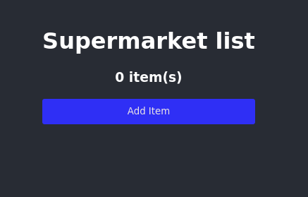
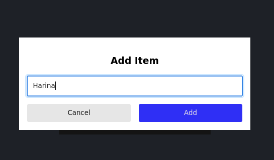
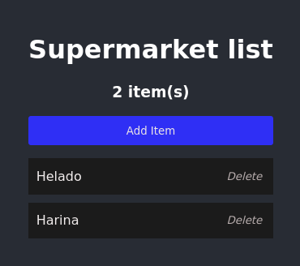

# Supermarket Simple List

**Supermarket Simple List** es una aplicación creada para aprender y practicar el uso de **React**, **TypeScript**, y **SASS**. La aplicación permite realizar operaciones básicas de una lista de supermercado, como crear, leer y eliminar items.

## Tecnologías utilizadas

- **Vite** como herramienta de bundling.
- **React** para la creación de componentes.
- **TypeScript** para una mejor gestión de tipos.
- **SASS** para la gestión de estilos.
- **Node.js** y **npm** como gestor de dependencias.

## Instalación

Para ejecutar la aplicación en modo de desarrollo, sigue estos pasos:

1. Clona este repositorio:
  ```bash
   git clone https://github.com/nikogalvan/supermarket-simple-list.git
   ```

2. Entra en el directorio del proyecto:

   ```bash
   cd supermarket-simple-list
   ```

3. Instala las dependencias:

   ```bash
   npm install
   ```

4. Para ejecutar la aplicación en modo de desarrollo:

   ```bash
   npm run dev
   ```

5. Para crear una versión optimizada para producción:

   ```bash
   npm run build
   ```

6. Para previsualizar la versión de producción:
   ```bash
   npm run preview
   ```

## Uso

La aplicación te permite:

- **Crear un nuevo item**: Agregar un item a la lista de supermercado.
- **Leer los items**: Ver los items existentes en la lista.
- **Eliminar un item**: Eliminar un item de la lista.

## Capturas de Pantalla

### Imagen 1


### Imagen 2


### Imagen 3
